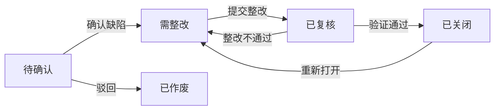
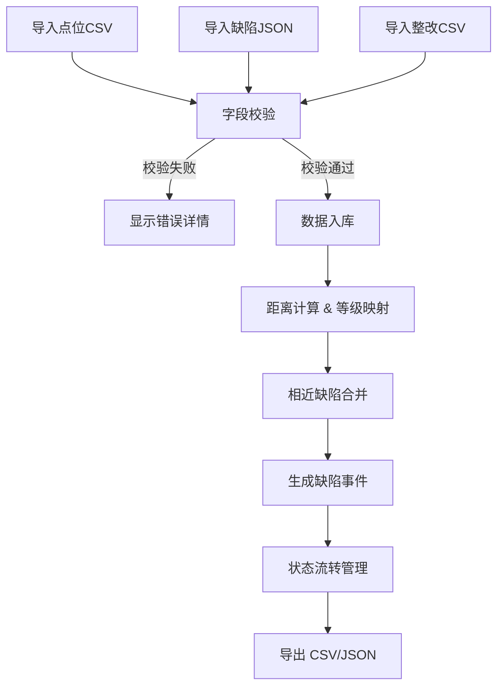

## 1. 产品概述

屋顶巡检缺陷复盘看板，用于管理屋顶巡检过程中发现的缺陷，支持批次数据导入、缺陷智能合并、状态全生命周期流转和数据导出。

- **核心目标**：打通从原始巡检数据到缺陷闭环管理的完整链路，提供可配置的合并规则和完整的审计追踪
- **目标用户**：巡检运维人员、质量管理人员、整改执行人员
- **核心价值**：减少人工核对工作量，确保缺陷不遗漏，保留完整整改证据链

## 2. 核心特性

### 2.1 用户角色

| 角色 | 注册方式 | 核心权限 |
|------|----------|----------|
| 巡检管理员 | 本地登录 | 导入批次、配置规则、确认缺陷、关闭事件、导出数据 |
| 整改人员 | 本地登录 | 查看缺陷、提交整改、添加复核备注 |

### 2.2 功能模块

1. **看板主页**：缺陷概览统计、批次列表、事件列表、快捷操作
2. **批次管理**：导入点位CSV/缺陷JSON/整改CSV、字段校验、批次详情
3. **缺陷事件**：事件列表、详情查看、来源证据、状态流转操作
4. **规则配置**：距离阈值配置、等级映射配置、规则版本管理
5. **数据导出**：导出CSV、导出JSON、操作日志

### 2.3 页面详情

| 页面名称 | 模块名称 | 功能描述 |
|---------|----------|----------|
| 看板主页 | 统计概览 | 各状态缺陷数量统计、批次概览、近期操作日志 |
| 看板主页 | 事件列表 | 按状态筛选、搜索、排序、批量操作 |
| 批次管理 | 数据导入 | 支持三种文件格式导入、实时校验、错误提示 |
| 批次管理 | 批次详情 | 批次数据预览、导入记录、关联缺陷 |
| 缺陷事件 | 事件详情 | 缺陷信息、来源证据、操作历史、状态流转按钮 |
| 规则配置 | 阈值配置 | 距离阈值(米)、等级映射表、保存/重置 |
| 数据导出 | 导出面板 | 选择批次、选择格式、预览、下载 |

## 3. 核心流程

### 3.1 主流程描述

1. 用户导入样例点位CSV、缺陷JSON、整改回传CSV
2. 系统校验字段合法性，生成导入报告
3. 根据配置的距离阈值和等级映射，自动合并相近缺陷生成事件
4. 用户在"待确认"状态下查看缺陷，补充信息后确认转为"需整改"
5. 整改完成后添加复核备注，状态转为"已复核"
6. 最终验证通过后关闭事件，状态转为"已关闭"
7. 导出完整数据为CSV和JSON格式

### 3.2 状态流转图

### 3.3 数据处理流程图

## 4. 用户界面设计

### 4.1 设计风格

- **主色调**：深蓝工业风 (#1e3a5f)，体现专业和稳重
- **辅助色**：橙色警示 (#f59e0b)、绿色正常 (#10b981)、红色严重 (#ef4444)
- **按钮风格**：直角硬朗风格，2px边框，hover时背景色加深
- **字体**：标题使用 "JetBrains Mono" 等宽字体，正文使用 "Inter"
- **布局风格**：仪表盘式网格布局，卡片带轻微阴影和边框
- **图标风格**：线性图标，使用 lucide-react 图标库

### 4.2 页面设计概览

| 页面名称 | 模块名称 | UI 元素 |
|---------|----------|----------|
| 看板主页 | 统计概览 | 4个统计卡片，带图标和趋势指示，深色背景 |
| 看板主页 | 事件列表 | 表格展示，行悬停高亮，状态标签彩色显示 |
| 批次管理 | 导入区域 | 拖拽上传区域，文件图标，进度条 |
| 缺陷事件 | 事件详情 | 左右分栏，左侧信息，右侧时间线 |
| 规则配置 | 表单区域 | 数字输入框，下拉选择，实时预览效果 |

### 4.3 响应式设计

- **桌面优先**：1280px 以上完整显示
- **平板适配**：1024px 以下调整为两列布局
- **移动适配**：768px 以下单列布局，侧边栏收起

### 4.4 交互细节

- 导入进度条动画
- 状态变更时的过渡动画
- 表格行的悬停效果
- 弹窗的淡入淡出
- 错误提示的抖动效果
