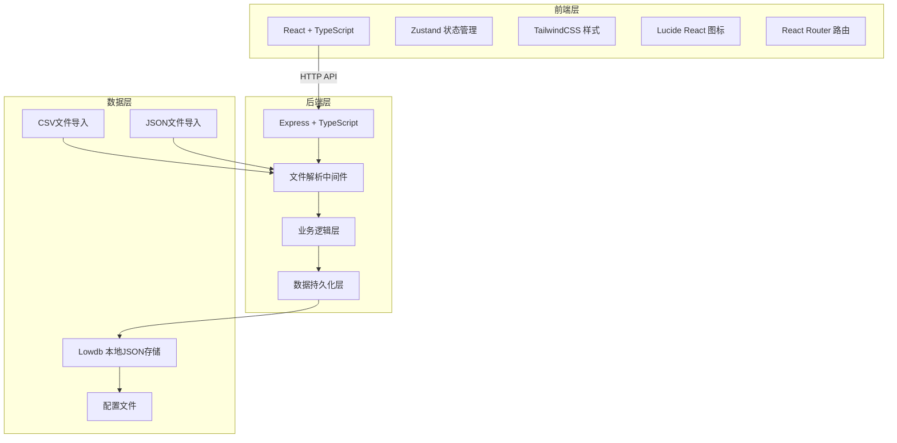
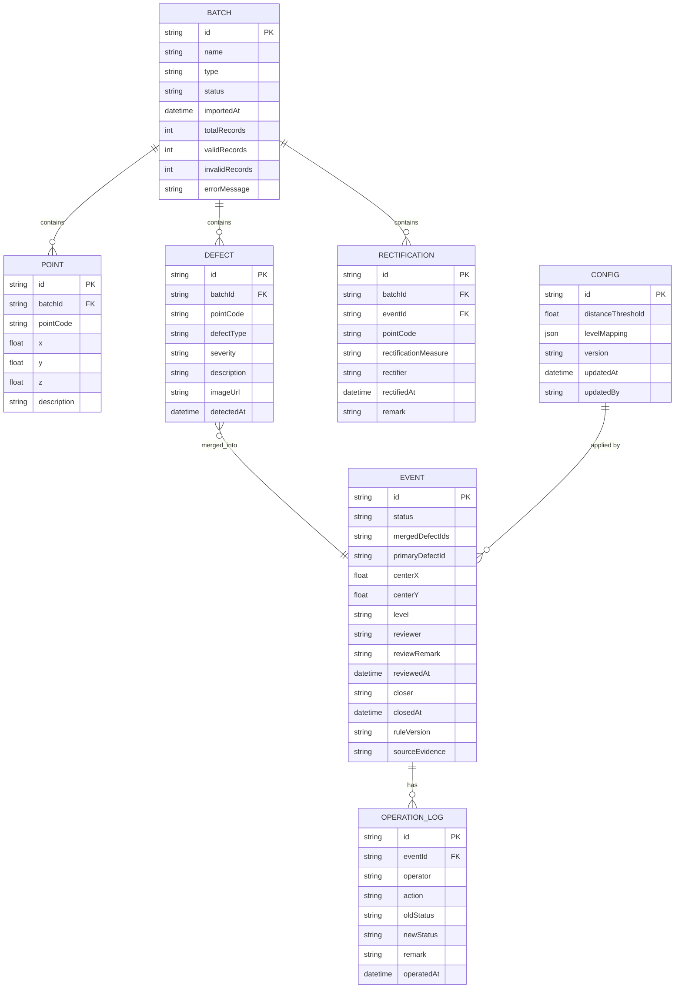

## 1. 架构设计



## 2. 技术栈说明

- **前端**: React@18 + TypeScript + Vite + TailwindCSS@3 + Zustand + React Router + Lucide React
- **后端**: Express@4 + TypeScript + Multer (文件上传) + CSV Parser
- **数据库**: Lowdb (本地JSON文件存储)
- **初始化工具**: vite-init (react-express-ts 模板)

## 3. 目录结构

```
├── src/                    # 前端源码
│   ├── components/        # 组件
│   │   ├── Dashboard/   # 看板组件
│   │   ├── Batch/       # 批次管理组件
│   │   ├── Event/       # 缺陷事件组件
│   │   ├── Config/      # 配置组件
│   │   └── common/     # 通用组件
│   ├── pages/           # 页面
│   ├── hooks/           # 自定义Hooks
│   ├── utils/           # 工具函数
│   ├── store/           # Zustand状态
│   ├── types/           # 类型定义
│   └── api/             # API调用
├── api/                   # 后端源码
│   ├── routes/          # 路由
│   ├── middleware/      # 中间件
│   ├── services/      # 业务逻辑
│   ├── models/        # 数据模型
│   └── utils/         # 工具函数
├── shared/                # 前后端共享类型
├── data/                  # 本地数据存储
│   ├── db.json         # 主数据库
│   ├── samples/        # 样例数据
│   └── uploads/        # 上传文件临时目录
├── public/              # 静态资源
└── README.md           # 项目说明
```

## 4. 路由定义

| 前端路由 | 页面 | 说明 |
|---------|------|------|
| / | 看板主页 | 统计概览 + 事件列表 |
| /batches | 批次管理 | 批次列表 + 导入功能 |
| /events | 事件列表 | 所有缺陷事件 |
| /events/:id | 事件详情 | 单个事件详情 + 状态操作 |
| /config | 规则配置 | 距离阈值 + 等级映射 |
| /export | 数据导出 | 导出CSV/JSON |

| 后端API | 方法 | 说明 |
|---------|------|------|
| /api/batches | GET | 获取批次列表 |
| /api/batches/:id | GET | 获取批次详情 |
| /api/import/points | POST | 导入点位CSV |
| /api/import/defects | POST | 导入缺陷JSON |
| /api/import/rectification | POST | 导入整改回传CSV |
| /api/events | GET | 获取事件列表 |
| /api/events/:id | GET | 获取事件详情 |
| /api/events/:id/status | PATCH | 更新事件状态 |
| /api/events/:id/remark | PATCH | 添加复核备注 |
| /api/config | GET | 获取配置 |
| /api/config | PUT | 更新配置 |
| /api/export/csv | GET | 导出CSV |
| /api/export/json | GET | 导出JSON |

## 5. 数据模型

### 5.1 ER图



### 5.2 核心数据类型 (shared/types.ts)

```typescript
export type EventStatus = 'pending' | 'need_rectify' | 'reviewed' | 'closed' | 'cancelled';

export type DefectSeverity = 'minor' | 'medium' | 'major' | 'critical';

export type BatchType = 'points' | 'defects' | 'rectification';

export interface Batch {
  id: string;
  name: string;
  type: BatchType;
  status: 'importing' | 'success' | 'failed';
  importedAt: string;
  totalRecords: number;
  validRecords: number;
  invalidRecords: number;
  errorMessage?: string;
}

export interface Point {
  id: string;
  batchId: string;
  pointCode: string;
  x: number;
  y: number;
  z: number;
  description?: string;
}

export interface Defect {
  id: string;
  batchId: string;
  pointCode: string;
  defectType: string;
  severity: DefectSeverity;
  description: string;
  imageUrl?: string;
  detectedAt: string;
}

export interface Rectification {
  id: string;
  batchId: string;
  eventId?: string;
  pointCode: string;
  rectificationMeasure: string;
  rectifier: string;
  rectifiedAt: string;
  remark?: string;
}

export interface Event {
  id: string;
  status: EventStatus;
  mergedDefectIds: string[];
  primaryDefectId: string;
  centerX: number;
  centerY: number;
  level: string;
  reviewer?: string;
  reviewRemark?: string;
  reviewedAt?: string;
  closer?: string;
  closedAt?: string;
  ruleVersion: string;
  sourceEvidence: SourceEvidence[];
  createdAt: string;
  updatedAt: string;
}

export interface SourceEvidence {
  type: 'defect' | 'point' | 'rectification';
  batchId: string;
  batchName: string;
  recordId: string;
  data: any;
}

export interface OperationLog {
  id: string;
  eventId: string;
  operator: string;
  action: string;
  oldStatus?: EventStatus;
  newStatus?: EventStatus;
  remark?: string;
  operatedAt: string;
}

export interface Config {
  id: string;
  distanceThreshold: number;
  levelMapping: LevelMappingItem[];
  version: string;
  updatedAt: string;
  updatedBy: string;
}

export interface LevelMappingItem {
  severity: DefectSeverity;
  level: string;
  color: string;
}
```

## 6. 核心算法说明

### 6.1 距离计算算法

使用欧几里得距离计算两点间距离：

```typescript
function calculateDistance(x1: number, y1: number, x2: number, y2: number): number {
  return Math.sqrt(Math.pow(x2 - x1, 2) + Math.pow(y2 - y1, 2));
}
```

### 6.2 缺陷合并算法

使用贪心合并算法：
1. 按缺陷等级排序（严重优先）
2. 遍历每个未合并的缺陷作为主缺陷
3. 计算与其他缺陷的距离，小于阈值则合并
4. 合并后取最高等级作为事件等级
5. 保留所有来源证据

### 6.3 字段校验规则

- 点位CSV校验：
  - pointCode: 必填，唯一
  - x/y/z: 必填，数字类型，有效范围校验
- 缺陷JSON校验：
  - pointCode: 必填，需存在于点位表
  - severity: 有效值为 minor/medium/major/critical
- 整改CSV校验：
  - pointCode: 必填
  - eventId: 需存在于事件表

## 7. 持久化方案

使用 lowdb 将所有数据存储在 `data/db.json` 中，包含以下结构：

```json
{
  "batches": [],
  "points": [],
  "defects": [],
  "rectifications": [],
  "events": [],
  "operationLogs": [],
  "config": {}
}
```

每次操作后自动写入文件，重启服务后从文件恢复数据。
